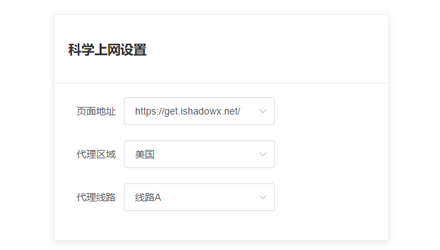
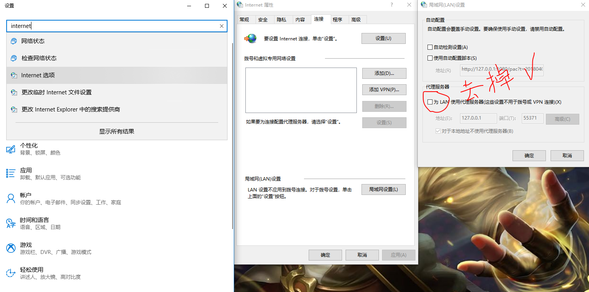

# win_ss_spider
一个实现科学上网的页面爬虫。
>灵感来源地：@[Little Von](https://github.com/VonSdite "Little Von")的[Auto_Shadowsocks](https://github.com/VonSdite/Auto_Shadowsocks "Auto_Shadowsocks")  项目

## 说明
本项目只是用来个人学习使用,若要拿来干啥坏事，那。。那我也没办法啊(¬_¬)

## 运行环境
 * 系统：windows
 * node：v8.9.4

## 使用
1. 下载项目文件到本地
2. 执行 
```
npm install
```
3. 运行 `Go.bat` 批处理文件(或者直接命令行执行 `npm run start`，再或者直接使用[pm2](http://pm2.keymetrics.io/docs/usage/cluster-mode/)来执行 `app.js` 文件)
4. 运行批处理之后系统默认的浏览器会打开 [http://127.0.0.1:8080/](http://127.0.0.1:8080/),此时，浏览器会打开一个页面，如下图

5. shadowsocks开启 `启用系统代理` ，设置如下图

    

## 可能会遇到的问题
1. 退出程序后上不了网了？
>退出的姿势不对啦，退出程序的时候，系统代理设置没有还原，解决如图


*注意：shadowsocks设置那里最好不要开启 `全局模式` ，开启“PAC"模式一般不会有这个问题，[想知道区别可以看这里](https://www.dujin.org/5461.html)*

2. 更改上网设置的时候会弹窗提示"shadowsocks已经在运行"？
>关了弹窗，不管